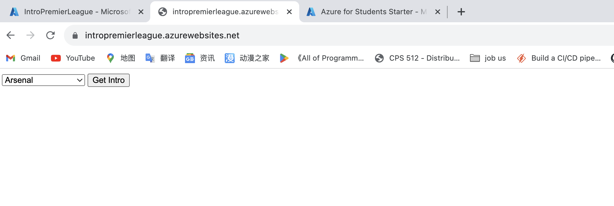
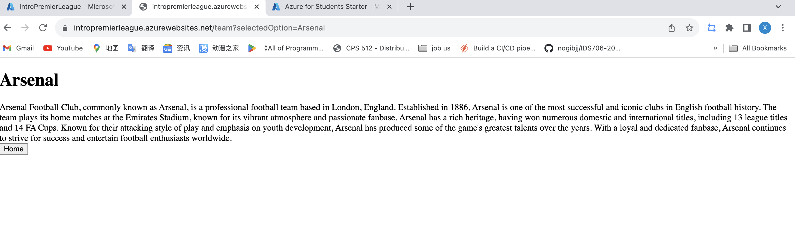
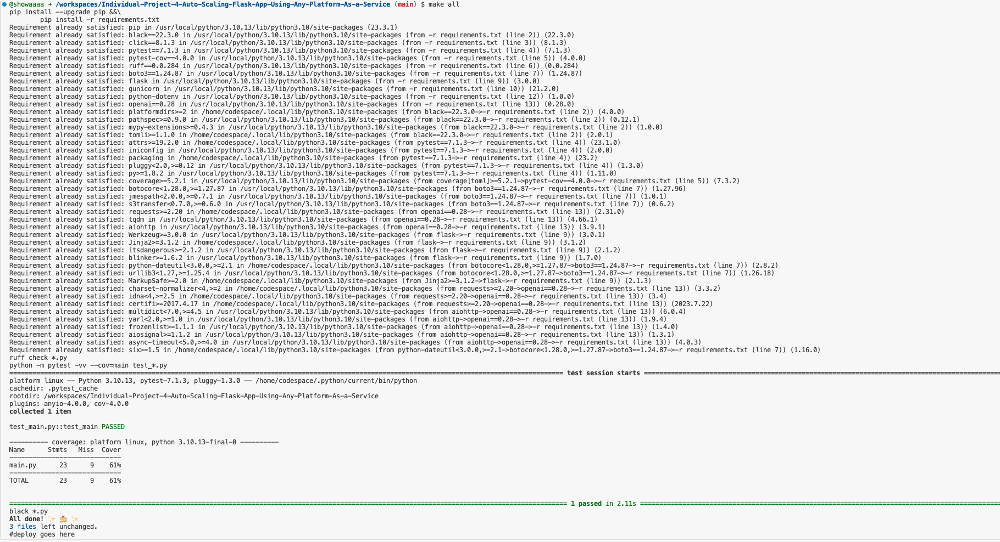
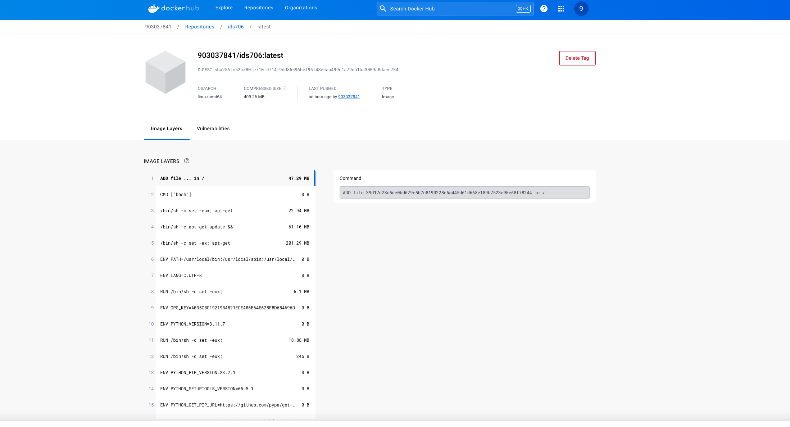
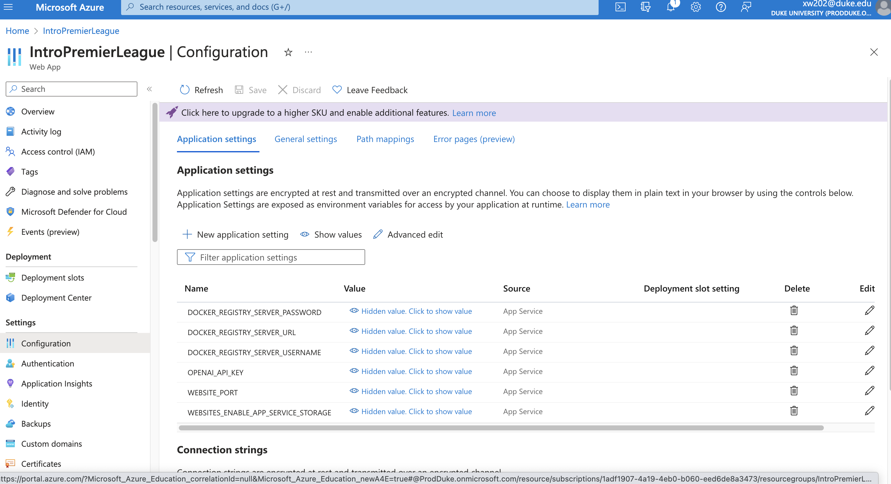

# IDS 706 Data Engineering Individual Project 4

## Website & Video explanation
[premier league introduction](https://intropremierleague.azurewebsites.net/) [Video explanation](https://youtu.be/_tQ7y1ZIzrs)

## Purpose of the project

The purpose of this individual project is to build a web application using Flask. Within the web app, we call the API for a Large Language Model (LLM) to implement our functionality.

## Overview

This project allows user to choose one premier league team from a dropdown menu, then a short introduction generated by LLM will be displayed to the user.

## Flask

A flask app is developed to handle requests from the user. The app is in `main.py`.

There are two routings in the app: 

1. `/`

    The homepage is routed to the `index()` function, which returns the `index.html` with a list of 5 teams.

2. `/team`
    
    The result page displays the result returned by the LLM to the user.

## LLM Integration

In this project, the API of OpenAI is integrated in the app. A token was generated for the app to use.

## Result of `make lint`, `make format`, `make test`

## Containerization

To make the project easy to deploy, it is containerized with docker.

First, login to Docker Hub in terminal using the following command.

`docker login --username <username>`

Then the files in the project directory is packed into a docker image using the following command:

`docker build -t <username>/<repo name> .`

Then the image is pushed to Docker Hub using the following command:

`docker push <username>/<repo name>`

It can be verified that the image is successfully uploaded by checking the repository.

Here is what this project's repository looks like after the push.

## Deployment

The website is then deployed to Azure. Make sure to add the LLM API key, and the website port `WEBSITES_PORT` to the configuration.

Here is a screenshot for the Azure page.

## Reference
[Professor Noah's ruff template](https://github.com/nogibjj/python-ruff-template)

